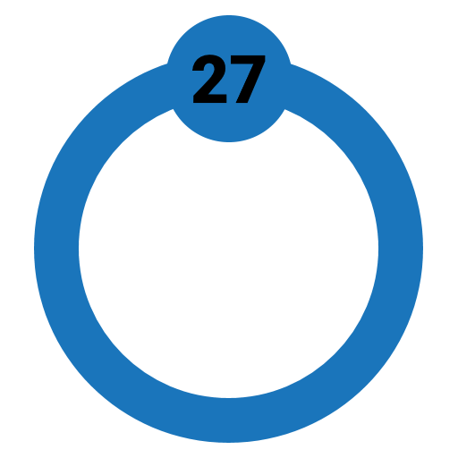

# Cobalt   

A bot used by the JKR Discord Server, based on the [guidebot framework](https://github.com/AnIdiotsGuide/guidebot) and with code snippets referenced from [woomy](https://github.com/woomyware/woomy).

Feel free to look around. If you find any issues or would like to make improvements to this bot, go ahead! Although this bot isn't *specifically* intended to be used outside of JKR, it's intentionally open source so others can contribute if they'd like.

Please keep in mind, this bot is **NOT** designed to be run on more than one server. You could probably modify it fairly easily to run on multiple, but in its native state is intended only to be run on one server as this is all that's needed for the JKR Discord.

[gpt-2-cobalt](https://github.com/the-sink/gpt-2-cobalt) is the repo for the Python server allowing the ``complete`` command to work.

## Requirements

- `git`
- `node` 12.0.0 or higher
- node-gyp build tools (required for Enmap and many other libraries)

## Intents

Intents can be added/removed near the top of ``index.js`` when the Discord client is created. For info about intents check out the [official Discord.js guide page](https://discordjs.guide/popular-topics/intents.html) and the [official Discord docs page](https://discord.com/developers/docs/topics/gateway#gateway-intents). Certain intents may require extra steps.

## Starting the bot

To start the bot, run `npm start` in your working directory.
